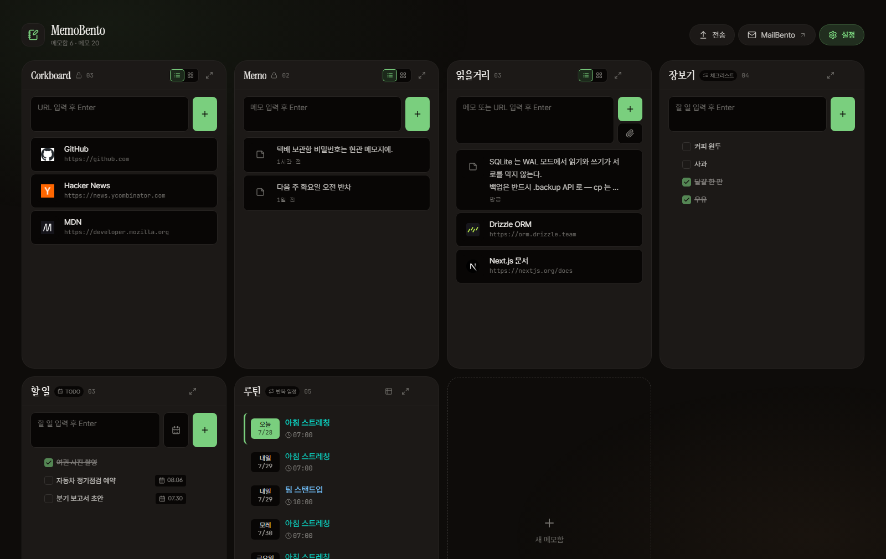
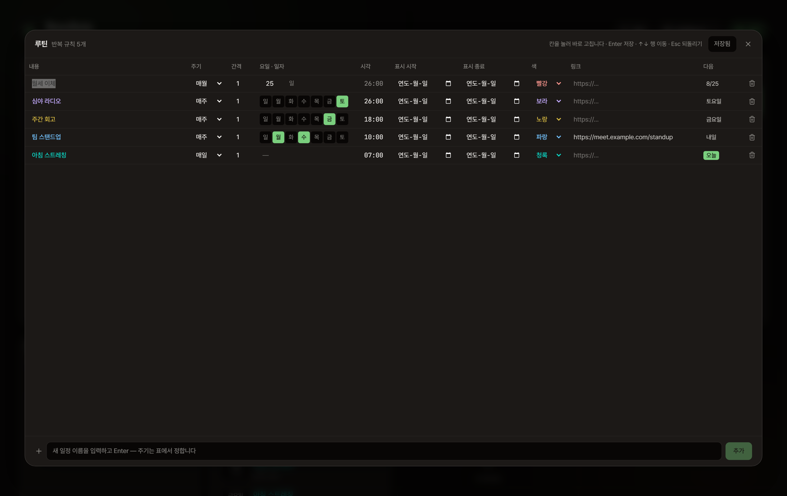

# MemoBento

메모·링크·이미지·PDF·파일을 **메모함(notebook) 단위로 모아 보는 셀프호스팅 대시보드**입니다.
자기 서버나 NAS 에 Docker 로 올려 쓰는 개인용 앱입니다.



## 기능

**메모함 4종** — 만들 때 종류를 고릅니다.

| 종류 | 담는 것 |
| --- | --- |
| 메모 | 텍스트 · 링크 · 이미지 · PDF · 파일 (리스트 / 그리드 보기) |
| 체크리스트 | 한 줄 항목 + 체크박스 |
| TODO | 한 줄 항목 + 기한 (달력에서 날짜·시각 지정) |
| 반복 일정 | 주기로 돌아오는 일정 |

**넣기** — 파일·URL·텍스트를 카드에 끌어다 놓거나, `Ctrl+V` 로 클립보드에서 바로 붙여넣습니다.
메모끼리 끌어서 다른 메모함으로 옮기거나 순서를 바꿀 수 있습니다.

**반복 일정** — 매일 / 매주 / 매월 / 매년, `n일·n주·n개월마다`. 규칙을 정해 두면 앞으로 2개월치
실제 날짜가 목록에 늘어섭니다. 규칙이 많아지면 표 형태로 한 번에 편집합니다.



**파일** — 8MB 조각으로 나눠 올리고 조각 단위로 재시도합니다 (기본 상한 5GB).
조각은 브라우저에서 AES-256-GCM 으로 암호화한 뒤 전송하고, 내려받을 때는 서비스 워커가
스트리밍 복호화합니다. 이미지·PDF 썸네일은 브라우저에서 만듭니다.

**접어 두기** — 메모함을 접으면 목록 맨 뒤로 가고 내용 대신 `표시하기` 만 보입니다.
눌러서 그때만 펼치며, 새로고침하면 다시 접힙니다. **보안 기능이 아닙니다** — 서버는 내용을
그대로 내려보내고 화면에서만 가립니다.

**에이전트용 예약 메모함** — `Memory for Agents`(메모)와 `Schedule for Agents`(반복 일정)가
처음 실행할 때 접힌 상태로 만들어집니다. MCP 로 붙은 에이전트가 쓰라고 비워 둔 자리입니다.
접기는 풀 수 있고 이름 변경·삭제는 잠겨 있습니다.

**그 밖에**

- 삭제한 메모함·메모는 30일간 휴지통에 남고 되살릴 수 있습니다
- 설정에서 전체 데이터를 JSON 한 파일로 내보내고 불러옵니다
- 라이트 / 다크 × 6가지 색 테마, 열 개수 조절
- 비밀번호 잠금 (선택) 과 로그인 기록

## 기술 스택

- **Next.js 15** (App Router) · React 19 · TypeScript
- **Tailwind CSS v4**
- **SQLite + Drizzle ORM** — 마이그레이션은 첫 실행 시 자동 적용
- **Docker** (Next.js standalone output)

## 빠른 시작

```bash
npm install
cp .env.example .env.local
npm run dev
```

`http://localhost:3000` 으로 접속합니다. `.env.local` 값은 전부 선택 항목이라
그대로 두어도 동작합니다.

기타 스크립트:

```bash
npm run build && npm start   # 프로덕션 확인
npm run db:generate          # 스키마 변경 후 마이그레이션 생성
npm run check:recurrence     # 반복 일정 로직 검증
```

## 환경 변수

| 이름 | 기본값 | 설명 |
| --- | --- | --- |
| `DATABASE_PATH` | `./data/memobento.db` | SQLite 파일 경로 |
| `UPLOAD_DIR` | `./data/uploads` | 첨부 원본·썸네일 저장 위치 |
| `MAX_UPLOAD_MB` | `5120` | 업로드 1건당 최대 크기 (MB) |
| `AUTH_PASSWORD` | (없음) | plaintext 또는 bcrypt 해시. 비우면 인증 끔 |
| `AUTH_SECRET` | (없음) | 세션 쿠키 암호화 키 (32바이트 base64) |
| `MAILBENTO_DB_PATH` | (없음) | MailBento 연동 (아래 참고) |
| `MAILBENTO_URL` | (없음) | 헤더의 MailBento 버튼 주소. 비우면 자동 유추 |
| `AGENT_URL` · `AGENT_TOKEN` | (없음) | 에이전트 채팅 (아래 참고) |

자세한 설명은 [`.env.example`](.env.example) 에 있습니다.

## Docker 배포

```bash
cp .env.example .env.local
mkdir -p data/uploads && chmod -R 777 data
docker compose up -d --build
```

- 기본 포트는 **3001** 입니다 (MailBento 를 3000 으로 같은 호스트에 함께 띄울 수 있게).
- DB 와 업로드 원본은 `./data` 볼륨에 영속화되어 재배포해도 유지됩니다.
- 컨테이너는 uid 1001 로 실행됩니다. 바인드 마운트가 uid 를 매핑하지 않는 환경
  (예: Synology)에서는 `data` 에 쓰기 권한이 없으면 부팅에 실패하므로 위 `chmod` 가 필요합니다.

## MailBento 연동 (선택)

자매 앱 [MailBento](https://github.com/columncat/MailBento) 와 나란히 띄우면,
MailBento 의 **Memo · Corkboard 위젯**을 MemoBento 에서 시스템 예약 메모함으로 함께 편집할 수 있습니다.

```bash
MAILBENTO_DB_PATH=/app/mailbento/mailbento.db
```

`docker-compose.yml` 에서 MailBento 의 data 디렉터리를 마운트한 뒤 위 경로를 지정하면
양쪽이 같은 데이터를 실시간으로 읽고 씁니다. 지정하지 않으면 MemoBento 자체 DB 를 쓰며,
설정 화면에서 MailBento 백업 JSON 을 불러올 수도 있습니다.

> 두 앱이 같은 행을 통째로 쓰기 때문에 양쪽을 동시에 열어 두고 편집하면
> 나중에 저장한 쪽이 이깁니다. 켜기 전에 MailBento DB 를 백업해 두세요.

## 에이전트 연동 (MCP)

메모함·메모를 에이전트가 읽고 고칠 수 있게 하는 MCP 서버가 [`mcp/`](mcp/) 에 있습니다.
같은 호스트·같은 내부망·SSH 어느 쪽에서든 붙습니다.

```bash
cd mcp && npm install && npm run build
```

```json
{
  "mcpServers": {
    "memobento": {
      "command": "node",
      "args": ["/path/to/MemoBento/mcp/dist/index.js"],
      "env": { "MEMOBENTO_URL": "http://127.0.0.1:3001", "MEMOBENTO_PASSWORD": "…" }
    }
  }
}
```

자세한 것은 [mcp/README.md](mcp/README.md) 를 보세요.

## 에이전트와 대화 (선택)

[BentoAgent](https://github.com/columncat/BentoAgent) 를 띄워 두면 우상단에 **대화**
버튼이 생깁니다. Discord 에서 하던 대화와 **같은 대화**라 창구를 옮겨도 맥락이 이어집니다.

```bash
AGENT_URL=http://127.0.0.1:4000
AGENT_TOKEN=…
```

둘 다 채워야 버튼이 뜹니다. 브라우저가 에이전트를 직접 부르지 않고 이 앱이 서버에서
프록시하므로 토큰은 화면에 실리지 않고, 이미 있는 로그인이 그대로 경계가 됩니다.

## 문서

코드를 고칠 계획이라면 [HANDOFF.md](HANDOFF.md) 에 설계 배경과 주의점이 정리되어 있습니다.

## 라이선스

[MIT](LICENSE)
